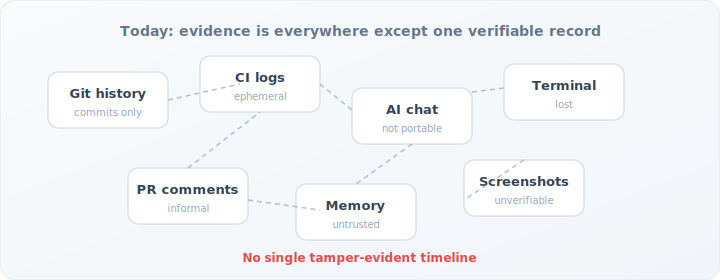

<div class="home-page">

<div class="hero">

<p class="hero-eyebrow">Local-first · Tamper-evident · Offline verification</p>

<h1 class="hero-title">Prove what happened during AI-assisted work</h1>

<p class="hero-lead">
Attestack is a developer CLI that records commands, notes, Git state, and agent activity into a <strong>hash-chained log</strong>, then exports a <strong>signed bundle</strong> anyone can verify — without your laptop, a SaaS account, or trust in chat history.
</p>

<div class="hero-actions">
<a class="hero-btn hero-btn-primary" href="quickstart.html">Get started in 5 minutes</a>
<a class="hero-btn hero-btn-secondary" href="use-cases.html">See use cases</a>
<a class="hero-btn hero-btn-secondary" href="https://github.com/kiket-dev/attestack">GitHub</a>
</div>

</div>

## The problem

AI coding assistants make work faster — but **accountability gets worse**. After a feature ships, teams still ask:

- Which tests actually ran before merge?
- What did the agent change, and what did a human review?
- Can we prove the timeline wasn't edited after the fact?

Today the answer is stitched together from **Git commits, CI logs, PR comments, and memory**. None of that is a single, portable, tamper-evident record.

<figure class="diagram-frame">

<figcaption>Evidence exists — but it is fragmented and hard to verify.</figcaption>
</figure>

## What Attestack does

Attestack adds a **local proof layer** on top of your normal workflow:

1. **Start a session** when work begins (`attestack start`).
2. **Record facts** as you go — shell commands, notes, Git snapshots, agent tool calls.
3. **Export a bundle** when done — a signed zip you can attach to a PR, ticket, or audit.
4. **Verify offline** — recompute hashes and check signatures; no server required.

<figure class="diagram-frame">

<figcaption>One session → one timeline → one portable artifact.</figcaption>
</figure>

<figure class="diagram-frame">

<figcaption>Each event links to the previous hash; tampering breaks verification.</figcaption>
</figure>

<figure class="diagram-frame diagram-animated">

<figcaption>Every feature branch can follow the same evidence loop.</figcaption>
</figure>

<figure class="demo-gif-frame">

<figcaption>Quickstart in under a minute — real CLI output.</figcaption>
</figure>

> [!NOTE]
> Attestack records **what happened**, not whether code is correct or secure. It is evidence tooling — not a substitute for review, testing, or static analysis.

## Practical uses

<div class="use-case-grid">

<a class="use-case-card" href="use-cases.html#individual-developer-with-ai-assistants">
<h3>AI-assisted feature work</h3>
<p>Record tests, notes, and agent tool calls; attach a bundle to your PR.</p>
<span class="use-case-link">Learn more →</span>
</a>

<a class="use-case-card" href="use-cases.html#tech-lead-reviewing-ai-assisted-changes">
<h3>Reviewing a PR</h3>
<p>Verify signature and event chain offline, then read a human report.</p>
<span class="use-case-link">Learn more →</span>
</a>

<a class="use-case-card" href="ci-integration.html">
<h3>CI pipeline evidence</h3>
<p>Wrap <code>cargo test</code> (or any command) in a session; upload the bundle as an artifact.</p>
<span class="use-case-link">CI integration →</span>
</a>

<a class="use-case-card" href="agent-setup.html">
<h3>Cursor, Claude, Copilot</h3>
<p>Connect <code>attestack-mcp</code> so agents append structured events during a session.</p>
<span class="use-case-link">Agent setup →</span>
</a>

</div>

## Before vs after

<div class="compare-grid">

<div class="compare-card compare-before">
<h3>Without Attestack</h3>
<ul>
<li>Reconstruct work from chat exports and memory</li>
<li>CI logs expire; hard to link to a specific change</li>
<li>No cryptographic proof the timeline is intact</li>
<li>Sharing evidence means granting repo or SaaS access</li>
</ul>
</div>

<div class="compare-card compare-after">
<h3>With Attestack</h3>
<ul>
<li>Structured session log in <code>.attestack/</code></li>
<li>Commands, exit codes, and Git hashes in one chain</li>
<li><code>attestack verify</code> detects tampering offline</li>
<li>Portable <code>.attestack.zip</code> — share the file, not your machine</li>
</ul>
</div>

</div>

## How it works

<ul class="workflow">
<li>init</li>
<li>start</li>
<li>run</li>
<li>note</li>
<li>snapshot</li>
<li>stop</li>
<li>bundle</li>
<li>verify</li>
</ul>

```bash
attestack init
attestack start "fix billing webhook"
attestack run -- pnpm test
attestack note "Reviewed AI-generated auth changes manually."
attestack snapshot
attestack stop
attestack bundle create
attestack verify .attestack/bundles/fix-billing-webhook.attestack.zip
```

## Why teams use it

<div class="feature-grid">

<div class="feature-card">
<span class="feature-icon">⛓</span>
<h3>Hash-chained events</h3>
<p>Each event links to the previous one. Reordering or editing breaks verification.</p>
</div>

<div class="feature-card">
<span class="feature-icon">📦</span>
<h3>Portable bundles</h3>
<p>Signed zip with session metadata, events, report, and optional artifacts.</p>
</div>

<div class="feature-card">
<span class="feature-icon">🔒</span>
<h3>Private by default</h3>
<p>Data stays local. Command output and diffs are opt-in. Path redaction on export.</p>
</div>

<div class="feature-card">
<span class="feature-icon">✓</span>
<h3>Offline verify</h3>
<p>Recompute digests and Ed25519 signatures — no network, no account.</p>
</div>

</div>

## Questions it answers

| Question | How |
|----------|-----|
| What happened in this session? | Event timeline + Markdown report |
| Which commands ran, and did they pass? | `command.finished` events with exit codes |
| What changed in Git? | Snapshot hashes at start/end |
| Was the record tampered with? | `attestack verify` on session or bundle |
| Can I share proof without repo access? | Export bundle; verifier runs anywhere |

## Next steps

<div class="nav-cards">

<a class="nav-card" href="installation.html">
<strong>Install</strong>
<span>Release binary or install script</span>
</a>

<a class="nav-card" href="quickstart.html">
<strong>Quick start</strong>
<span>First session in five minutes</span>
</a>

<a class="nav-card" href="scenarios.html">
<strong>Scenarios</strong>
<span>Step-by-step workflows</span>
</a>

<a class="nav-card" href="cli-spec.html">
<strong>CLI reference</strong>
<span>Every command and flag</span>
</a>

</div>

## Non-goals

- No SaaS account requirement
- No blockchain dependency
- No automatic capture of private AI transcripts
- No always-on surveillance

</div>
