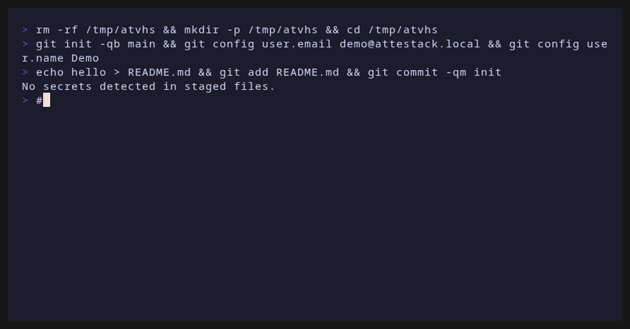

# Quick start

Record your first Attestack session in a few minutes.

> [!TIP]
> Run `attestack doctor` anytime to check store initialization, signing identity, Git availability, and active session health.

## Prerequisites

| Requirement | Notes |
|-------------|-------|
| Shell | Linux, macOS, or Windows |
| [Git](https://git-scm.com/) | Required for `snapshot`; recommended for real projects |
| Rust (optional) | Only if building from source |

## Install

```bash
curl -fsSL https://raw.githubusercontent.com/kiket-dev/attestack/main/scripts/install.sh | bash
```

See the [Installation guide](installation.md) for manual downloads or building from source.

<figure class="demo-gif-frame">

<figcaption>End-to-end session: init → start → record → bundle → verify.</figcaption>
</figure>

Regenerate locally: `./scripts/render-demos.sh` (requires [VHS](https://github.com/charmbracelet/vhs)).

## Walkthrough

<ol class="steps">

<li>

### Initialize a project

Create a Git repo and initialize Attestack in it:

```bash
mkdir my-project && cd my-project
git init -b main
echo "hello" > README.md
git add README.md && git commit -m "init"

attestack init
attestack doctor
```

</li>

<li>

### Start a session

Open a session with a descriptive title. Attestack captures an initial Git snapshot when inside a repo:

```bash
attestack start "demo session"
attestack status
```

</li>

<li>

### Record work

Run commands, add notes, and capture Git state as you go:

```bash
attestack run -- echo hello
attestack note "Reviewed generated change"
attestack snapshot
```

</li>

<li>

### Close and review

Stopping the session writes a Markdown report under `.attestack/sessions/<id>/reports/`:

```bash
attestack stop
attestack report
```

</li>

<li>

### Export and verify

Create a signed bundle and verify it offline:

```bash
attestack bundle create
attestack verify .attestack/bundles/*.attestack.zip
```

> [!TIP]
> Use `--redact-paths` when sharing bundles outside your machine:
>
> ```bash
> attestack bundle create --redact-paths
> ```

</li>

</ol>

## Scripting with JSON

Most commands accept `--json` for automation:

```bash
attestack status --json
attestack verify .attestack/bundles/demo.attestack.zip --json
attestack doctor --json
```

## Next steps

- [Installation](installation.md) — release binaries and install script
- [Use cases](use-cases.md) — who Attestack is for and why
- [CI integration](ci-integration.md) — GitHub Actions and generic CI
- [Agent guide](agent-guide.md) — `attestack agent` and MCP server
- [CLI reference](cli-spec.md) — every command, flag, and exit code
- [Data model](data-model.md) — sessions, events, and bundles
- [Security model](security-model.md) — keys, privacy, and verification
